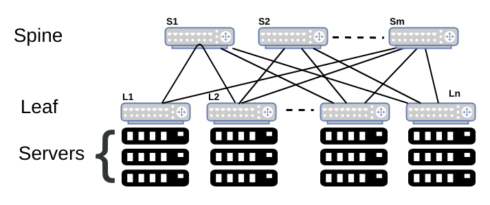
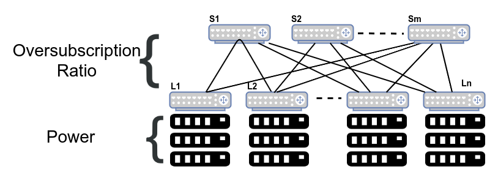

The Clos topology allows you to build very large networks using relatively small building blocks. When the ascent of the hyperscalars began, I’ve heard Google started building networks with 24-port switches, though I can’t be certain as I wasn’t at Google. Around the start of the previous decade, the hyperscalars had moved to using Broadcom’s Trident chip with 64 10GbE ports as the building block. By the end of that decade, Broadcom had started shipping Tomahawk 4 to select customers. **Tomahawk 4** is a single packet switching chip that supports 256 ports of 100GbE. Not so long ago, that was an almost mythical number for a single switching ASIC.

The shift to Clos topology as the network topology underlies everything that’s followed in networking in the past decade or more. In this post, we’ll consider the effects of a high switch port count chip such as Tomahawk 4 on the Clos topology. For those interested in more information about Clos topology, please read my book [Cloud Native Data Center Networking](https://www.amazon.com/Cloud-Native-Data-Center-Networking/dp/1492045608/). A rough summary of that chapter is as follows.`

## A Terse Introduction to Clos

To most network operators, the Clos topology is the leaf-spine topology, consisting of two layers of switches, one layer called the leaf and the other the spine. The next level up in sophistication is the three-tier Clos topology where a number of 2-tier Clos networks are connected together via another layer of switches. For a handful of networks in the world that are beyond this scale, the Clos topology essentially becomes a fractal, each two-tier of switches providing connectivity to the next level of two-tier switches. In other words, with a four-tier Clos topology, the leaf-spine network at the top provides connectivity to n leaf-spine networks at the bottom.

The current generation of data centers are standardizing 25GbE links towards the servers and 100GbE towards the spine switches. Some of the older cloud native data centers used 10GbE as the server link speed and 40GbE as the inter-switch links (ISL, also called uplink). Hyperscalars, the main target of Tomahawk 4, are going beyond with 200GbE and 400GbE for ISLs. The ratio of input to output bandwidth — going in the direction of servers to the upper layers — is called the **oversubscription ratio**. A non-oversubscribed switch has equal input and output bandwidth. In other words, a non-oversubscribed switch has as much bandwidth towards the spine switches as the bandwidth from the servers. Most data centers, hyperscalar or otherwise, use non-oversubscribed switches from the spine upwards. The leaf switches are usually oversubscribed, with the oversubscription ratio varying between two (i.e. two server ports have one uplink port) to four.

## The Sweet Spot for Leaf Switch Port Count

The leaf switch (also called **ToR** for Top of Rack), the layer of switches to which servers are connected, has ports with two different link speeds: one set devoted to connecting servers, and the other set is for interconnecting switches. **Power typically dictates how many servers are in a rack**. 40 servers per rack is common in hyperscalars while 20 ports per rack is more common in the enterprise data centers. I have also encountered dense 96 server racks. **The number of uplink ports is determined by the oversubscription ratio**. 40 server-facing ports of 25GbE is 1 Tbps of input bandwidth. Assuming an uplink speed of 100GbE, we need 10 uplink ports for a non-oversubscribed switch. Thus, we have 40+10 ports as the ideal switch port for such deployments.

In case of the 96 server rack, 96 ports of 25G gives a bandwidth of 2.4Tbps (25\*96). A non-oversubscribed switch needs 2.4Tbps of uplink bandwidth or 24 ports of 100GbE. A 4.8 Tbps switch would be very good for most data centers. Its also well known that except for the hyperscalars, most data center switches run empty a lot of the time. 4.8Tbps is 48 ports of 100GbE. Some racks are dedicated to storage and may push higher bandwidths such as 32 storage facing ports of 100GbE and use an oversubscription ratio of 1:1 and thus desire 32 ports of 100GbE as uplink ports. In such a case, a leaf switch needs to support at least 6.4 Tbps for a non-oversubscribed model.

## The Sweet Spot for Spine Switch Port Count

A spine switch on the other hand connects leaf switches. Thus a spine switch with 32 ports can hook up 32 racks. A spine switch with 64 ports can connect upto 64 racks. Assuming even 20 servers per rack, 64 racks represents about 1,280 servers, a large number for many enterprises. With 96 servers per rack, 64 racks represents 7,104 servers. With 256 ports, this number varies from 5,120 servers (for 20 servers per rack) to 24,576 servers (with 96 servers per rack). We’re now talking mighty large numbers in a single data center for anyone but the hyperscalars.

As you move up the Clos topology, you can use a third tier of 256 port switches to interconnect 256 two-tier Clos topologies. This means with even 20 servers per port, you can connect 256\*5,120 = 1,310,720 servers. With a four tier Clos topology, you get even higher numbers than this. These are ginormous numbers. Thus, we see that the use of a high port count switch makes a lot of sense as we move up the Clos topology, especially for larger networks.

From a cost perspective, cabling is the biggest expense on the networking side. Reducing the number of tiers helps reduce the amount of cables used and therefore translates directly to reducing the cost of capital expenditure on a data center. The cost of optics for 400GbE can be lower than four 100GbE ports and this is another factor driving the use of Tomahawk 4 by the hyperscalars.

## Resilience And High Switch Port Count

If cost and scale are two of the major design factors in a cloud native data center, resilience is the third major design factor. How do high port count switches affect resilience? **One of the key design principles of cloud native network design is that the failure should be as contained as possible, and detected as quickly as possible**. Tomahawk 4 is still a single chip which means that it’ll still fail in far simpler ways than a chassis or a multi-chip approach. So, is there a reason an operator shouldn’t consider using Tomahawk 4 as a spine switch, especially as a 256 100 GbE port switch?

I’ll start by saying that outside of hyperscalars and a few other networks, most data centers can’t use a 400GbE link efficiently. It is well known that enterprise data center links have very low utilization rates. So, in considering Tomahawk 4, 100GbE seems like a good speed to frame the discussion.

256 ports of 100GbE is 256 racks, which is a decent sized network. From a failure analysis standpoint, it possesses the one problem that a systemic failure can possibly bring the entire network down. For example, with the use of a link state protocol, there’s a single area (or level) and so the link state of every one of the 256 ToR switches is flooded to every other ToR switch. A bug in the flooding code could possibly bring the entire network down. Instead of such a topology, you can imagine an alternate 3-tier Clos topology with 4 pods of 64 ToR switches, for example. In such a topology, flooding failure is contained within a pod reducing the catastrophic effects of a systemic failure. Engineering is all about trade offs and its important for people to consciously make choices. Failure analysis is one area I frequently see network designers fall back to old ways of thinking.

## Wither Chassis Switches?

Another interesting side effect of Tomahawk 4 is that calls into question enterprises who relied on chassis switches to get a higher port count switch for the spine. Traditional vendors used this to continue to sell their proprietary switches over fixed-form factor switches coming from network disaggregation vendors such as Dell and Edgecore (among others). Its worth reconsidering the need for a chassis switch in most data centers, at least in just about every enterprise data center.

## Summary

To summarize, high port count switches are more useful higher up in the Clos topology than lower. The number of ports at the leaf (i.e. ToR) is primarily determined by the power available per rack, the oversubscription ratio and the use of high-density servers. A high port count spine switch allows a two-tier Clos topology support more racks. Therefore, more enterprise data centers can manage with a two-tier Clos network. However, at higher switch port counts, this benefit needs to be carefully balanced against a systemic failure taking down the entire network. 64 ports at any speed seems like a sweet spot for many cases, with the hyperscalars benefiting with the higher port counts of 128 and 256.

*Note: The post is structured around the use cases and traffic patterns at the time of writing. 10 GbE was fast enough for a lot of data center networks a decade ago.*



<noscript>Please enable JavaScript to view the <a href="https://disqus.com/?ref_noscript">comments powered by Disqus.</a></noscript>

